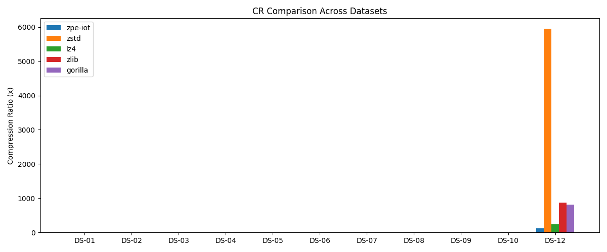
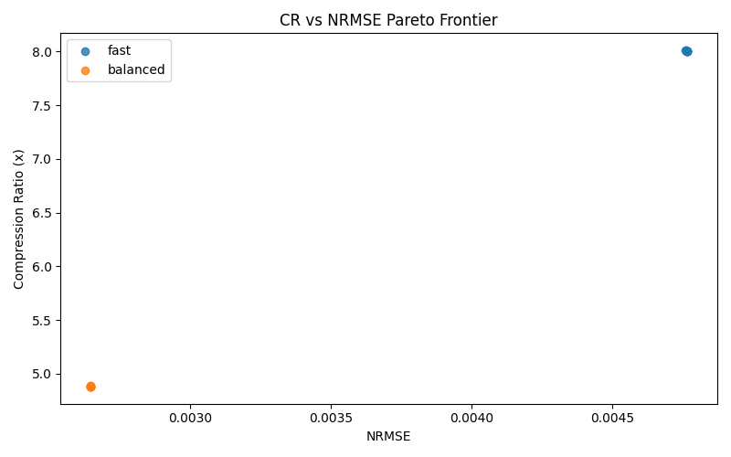
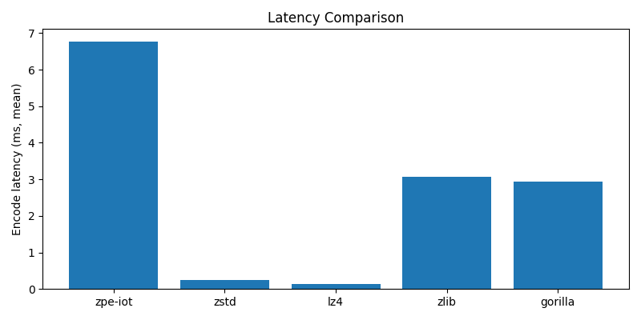
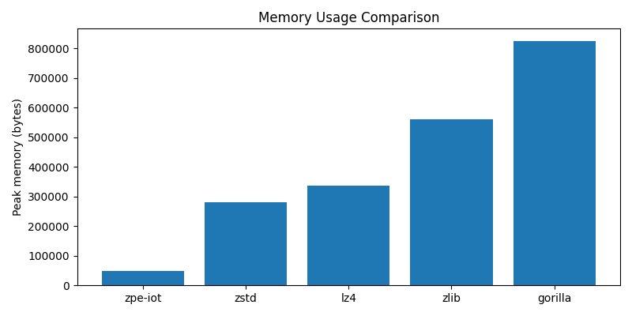

<p>
  
</p>

# ZPE-IoT Benchmark Results

This page promotes the current benchmark authority surface. `PT-6` is the harness pass label for the promoted benchmark tier, `E1` is the real-public dataset tier, and `E2` is the real-customer tier.

<p>
  
</p>

| Field | Current truth |
|---|---|
| Evidence class | `E1` |
| Active dataset surface | `DS-01..DS-10`, `DS-12` |
| Explicitly blocked dataset | `DS-11` |
| Promoted benchmark verdict (`PT-6`) | `PASS (10/11 wins)` |
| Mean CR | `17.163613932777356x` |
| Active summary artifact | [`../validation/results/bench_summary_E1_real_public_20260321T225305.json`](../validation/results/bench_summary_E1_real_public_20260321T225305.json) |
| Customer dataset tier (`E2`) | `NOT_AVAILABLE` |

<p>
  
</p>

| Term | Meaning |
|---|---|
| `PT-6` | Harness pass label for the promoted benchmark tier; it passes when wins exceed half of the READY dataset count. |
| `FINAL` | Promoted benchmark label for `E1` or `E2` evidence tiers. |
| `PROVISIONAL` | Proxy-only `E0` benchmark label. |
| `E0` | Proxy or synthetic evidence tier. |
| `E1` | Real-public dataset tier. |
| `E2` | Real-customer tier. |
| `READY` | Dataset is present, provenance-verified, and admissible for the promoted surface. |
| `NRMSE(window-normalized)` | Window-normalized reconstruction error metric used in the benchmark harness. |

<p>
  
</p>

| Surface | Current handling | Artifact |
|---|---|---|
| Promoted authority | 11 real-public READY datasets with identical raw float64 inputs for all compressors | `../validation/results/bench_summary_E1_real_public_20260321T225305.json` |
| Generated overall summary | Current run bundle summary | `../validation/results/bench_summary_20260321T225305.json` |
| Generated proxy split | Non-promoted proxy view | `../validation/results/bench_summary_E0_proxy_20260321T225305.json` |
| Generated customer split | Placeholder only; no READY customer datasets are promoted here | `../validation/results/bench_summary_E2_real_customer_20260321T225305.json` |

Comparator set: `zstd(level=3)`, `LZ4`, `zlib(level=6)`, `Gorilla-proxy (XOR+zlib)`.

**Gorilla-proxy disclosure:** The "Gorilla-proxy" comparator is a simplified ~25-line XOR-delta + zlib implementation inspired by Facebook Gorilla's XOR encoding approach. It is **not** Facebook's production Gorilla time-series codec. See `validation/benchmarks/bench_vs_gorilla.py` for the full source.

**Baseline methodology:** All compression ratios use float64 (8 bytes/sample) as the raw-size denominator. Against a float32 baseline, ratios would be approximately half. ZPE-IoT is bounded-lossy; zstd, LZ4, zlib, and Gorilla-proxy are lossless.

Winner rule: the highest compression ratio wins for a dataset, subject to the same decode path and fidelity measurement rules.

Encode/decode pathway: `zpe:encode_to_packet_bytes_then_decode_from_packet_bytes; baselines:compress_raw_bytes_then_decompress_raw_bytes`.

Iterations: `5` with warmup `1`.

## Detailed Results

| Dataset | Evidence | zpe-iot CR | zpe-iot NRMSE(window-normalized) | Best comparator CR | Winner |
|---|---|---:|---:|---:|---|
| DS-01 | E1 | 6.18 | 0.0029 | zlib `4.26` | zpe-iot |
| DS-02 | E1 | 6.40 | 0.0151 | zstd `1.70` | zpe-iot |
| DS-03 | E1 | 7.66 | 0.0060 | zlib `3.81` | zpe-iot |
| DS-04 | E1 | 7.16 | 0.0440 | zstd/zlib `1.05` | zpe-iot |
| DS-05 | E1 | 7.29 | 0.0041 | zlib `7.02` | zpe-iot |
| DS-06 | E1 | 6.24 | 0.3175 | Gorilla-proxy `2.99` | zpe-iot |
| DS-07 | E1 | 6.98 | 0.0174 | zstd/zlib `1.37` | zpe-iot |
| DS-08 | E1 | 6.57 | 0.0299 | zstd `3.57` | zpe-iot |
| DS-09 | E1 | 6.38 | 0.0055 | zstd `2.55` | zpe-iot |
| DS-10 | E1 | 7.47 | 0.0923 | zstd/zlib `1.91` | zpe-iot |
| DS-12 | E1 | 120.47 | 0.0000 | zstd `5957.82` | competitor |

Full comparator-by-dataset detail lives in the per-run summary JSON rather than this page.

### Charts





<p>
  
</p>

| Boundary | Current truth |
|---|---|
| `DS-11` | Explicitly `BLOCKED` and excluded from the active E1 authority surface |
| `DS-12` | Competitor win on the current E1 real-public surface |
| E2 | No active real-customer claim tier is promoted |
| Fit | ZPE-IoT is not a strict lossless codec and is not a fit for already-compressed or cryptographically random payloads |
| Gorilla-proxy comparator | Simplified XOR+zlib proxy, not Facebook's production Gorilla codec |
| Stream length cap | 65,536-sample hard cap (2-byte header); ~16 minutes at 60 Hz |
| Non-finite inputs | NaN and Inf values cause codec failure |
| CR denominator | All ratios use float64 raw size as denominator; against float32 baselines, ratios are approximately half |

<p>
  
</p>

## Reproducibility Envelope

- Dataset manifest SHA256: `64f004cfac32a0f48303b4eadaca680ed95abb93a652ebf4653f0fa16858f24c`
- Toolchain: `{"cargo": "cargo 1.90.0 (840b83a10 2025-07-30)", "lz4": "4.4.5", "numpy": "2.4.3", "python": "3.14.0", "zstandard": "0.25.0"}`
- Hardware profile: `{"machine": "arm64", "platform": "macOS-15.5-arm64-arm-64bit-Mach-O", "processor": "arm"}`
- Commands: `{"comparators": ["python validation/benchmarks/bench_vs_zstd.py", "python validation/benchmarks/bench_vs_lz4.py", "python validation/benchmarks/bench_vs_zlib.py", "python validation/benchmarks/bench_vs_gorilla.py"], "run_benchmarks": "python validation/benchmarks/run_benchmarks.py"}`

## How to Reproduce

```bash
ZPE_IOT_ROOT="${ZPE_IOT_ROOT:-$(pwd)}"
cd "$ZPE_IOT_ROOT"
source .venv/bin/activate
python validation/benchmarks/run_benchmarks.py
python validation/benchmarks/generate_report.py
python validation/benchmarks/run_wi1_ablation.py --repeats 5
python validation/benchmarks/run_zh1_ablation.py --repeats 5
```

<p>
  
</p>
